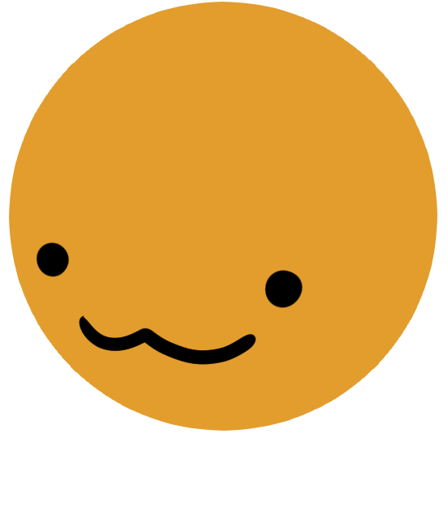
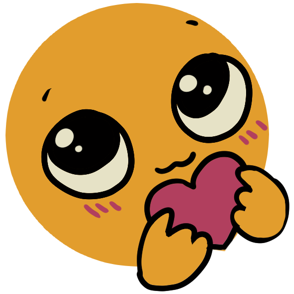
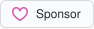

## Hey, I’m Raul 

My main interests are testing, tooling, and developer experience. I'm a firm believer in tools that make problems easier to see, not harder to understand.

Most of my work has been in design systems, frontends, and testing, where my particular focus was in building feedback loops developers can trust.

I'm currently part of [<picture><source media="(prefers-color-scheme: dark)" srcset="./assets/vitest-dark-mode.svg"></picture> Vitest's core team](https://vitest.dev).

Lately, I've been exploring some new interests in lower-level tooling using Rust and Zig.

###  Sponsors

  <!-- sponsors --><!-- sponsors -->
    
  

---

Emotes designed by [Chloe Vazquez](https://chloevazquezart.com).
